# high_impact アーキテクチャドキュメント

## 概要

high_impact は2Dゲーム開発のための軽量なC言語フレームワークです。シーンベースのゲーム構成、エンティティ・コンポーネントシステム、カスタムメモリ管理、そして複数のレンダリングバックエンドをサポートしています。

## システム全体構成

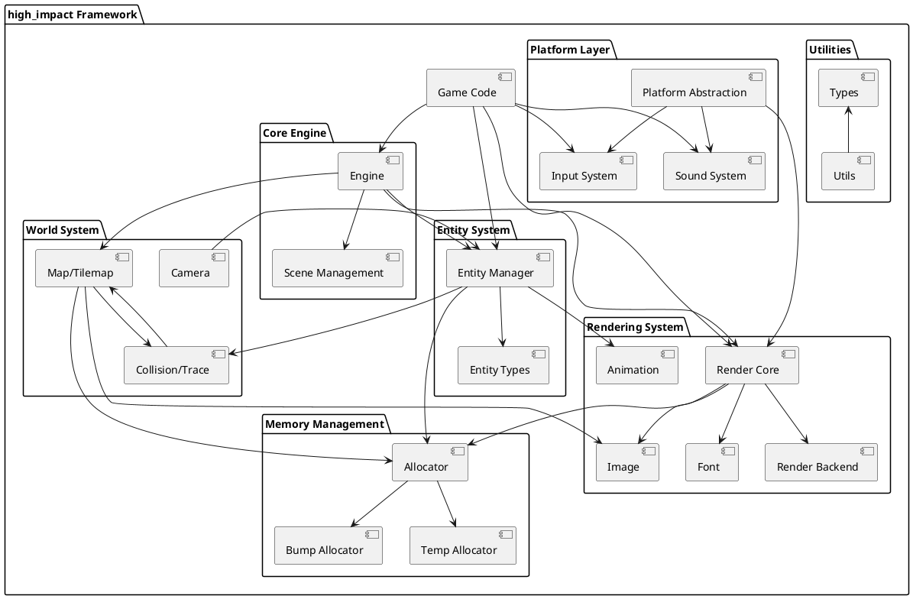

## レイヤー構造

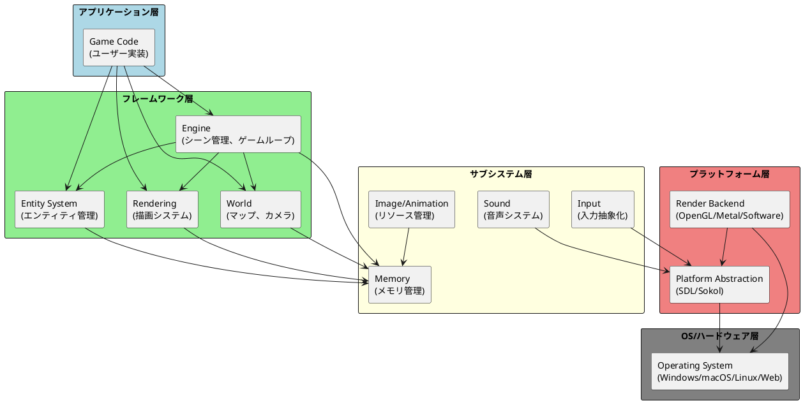

## コアモジュール詳細

### 1. Engine (engine.h/c)

エンジンはゲームの中心的なシステムで、ゲームループ、シーン管理、時間管理を担当します。

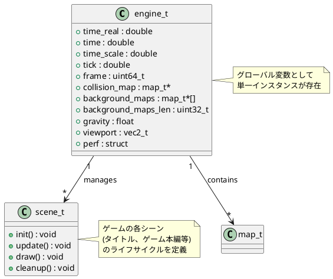

**主要機能:**
- シーンの切り替え管理 (`engine_set_scene()`)
- レベルの読み込み (`engine_load_level()`)
- 時間管理とフレームカウント
- ビューポート管理
- パフォーマンス統計の収集

### 2. Entity System (entity.h/c, entity_def.h)

エンティティシステムは、ゲーム内の動的オブジェクトを管理します。仮想関数テーブル(vtable)を使用したポリモーフィズムを実現しています。

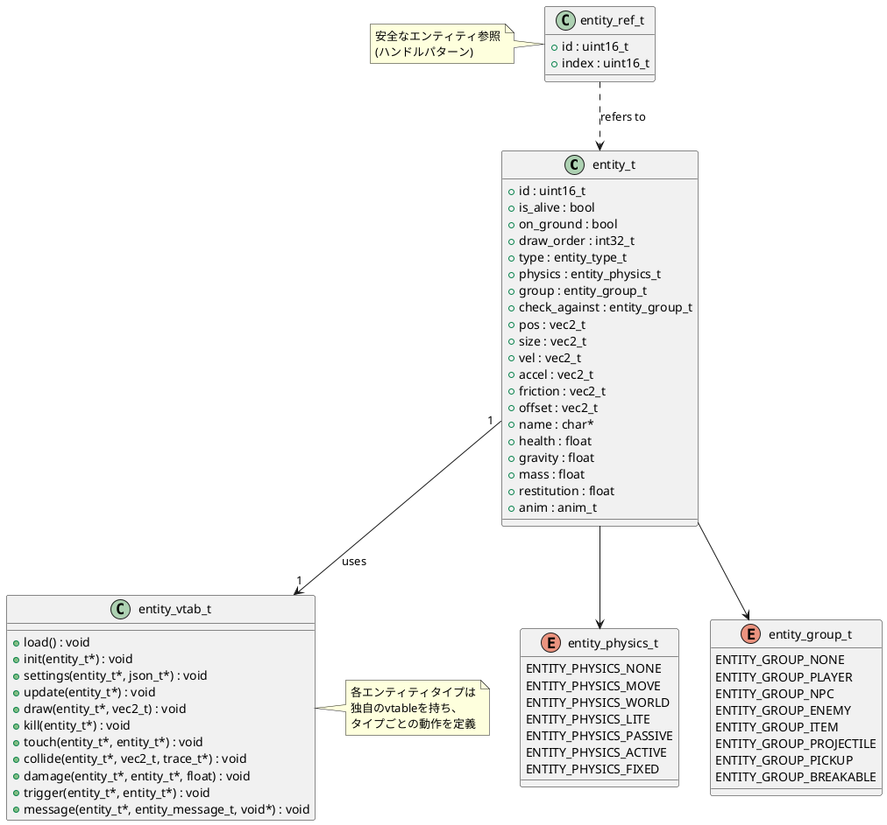

**主要機能:**
- エンティティのスポーンと管理
- vtableによる仮想関数システム
- 物理シミュレーション (`entity_base_update()`)
- 衝突検出とグループ管理
- エンティティ検索機能 (近接、タイプ別など)

### 3. Memory Management (alloc.h/c)

カスタムメモリ管理システムで、malloc/freeを使用せず、単一のメモリブロック(ハンク)から割り当てを行います。

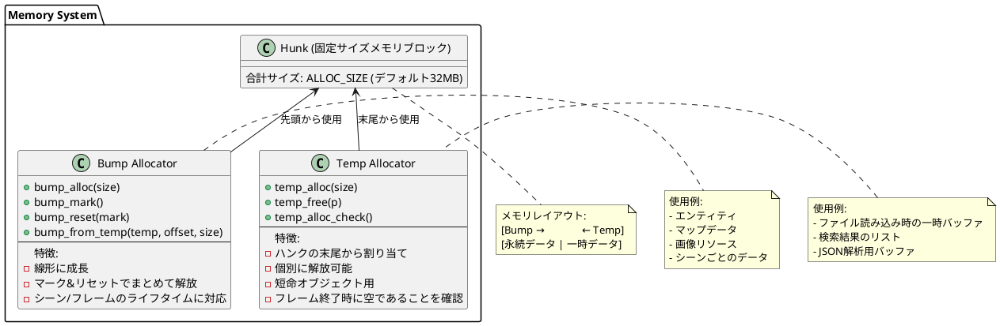

**メモリライフタイム管理:**

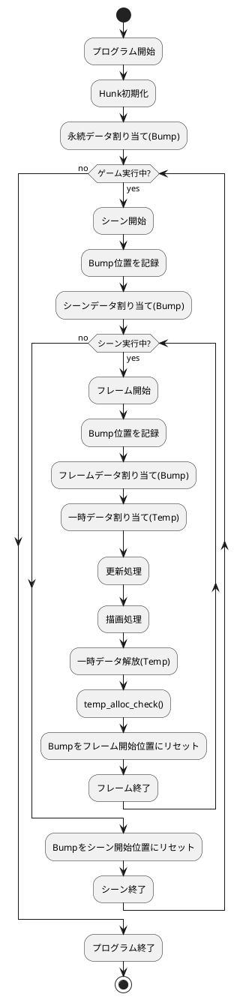

### 4. Rendering System (render.h/c)

描画システムは複数のバックエンド(OpenGL, Metal, Software)をサポートし、統一されたAPIを提供します。

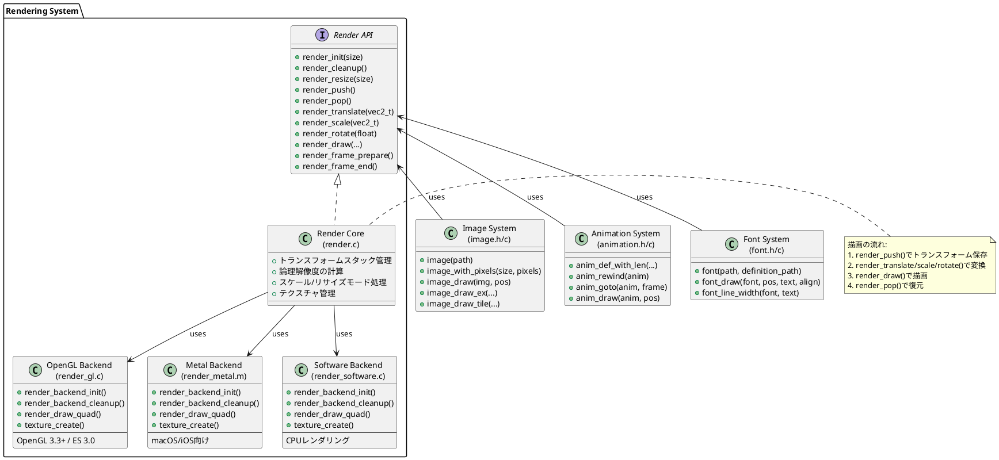

**レンダリングパイプライン:**

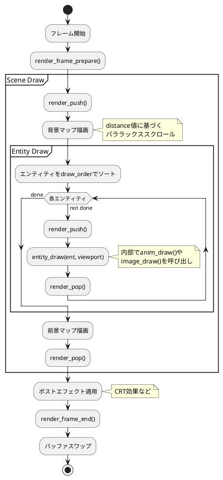

### 5. Platform Layer (platform.h/c, platform_sdl.c, platform_sokol.c)

プラットフォーム抽象化レイヤーは、異なるバックエンド(SDL, Sokol)への統一インターフェースを提供します。

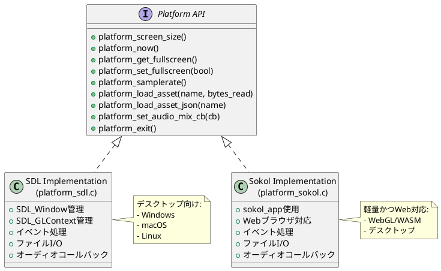

### 6. Input System (input.h/c)

入力システムは、キーボード、マウス、ゲームパッドの入力を抽象化し、アクションベースのバインディングを提供します。

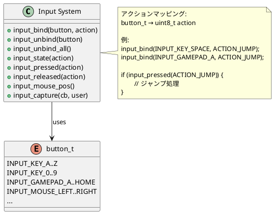

### 7. World System (map.h/c, camera.h/c, trace.h/c)

ワールドシステムは、タイルマップ、カメラ、衝突検出を管理します。

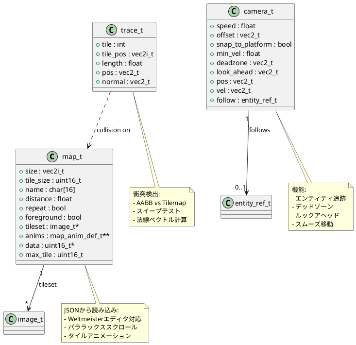

### 8. Sound System (sound.h/c)

サウンドシステムは、音源の管理と再生を担当します。

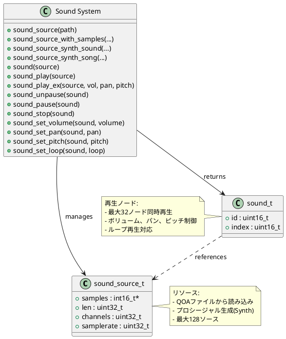

## データフロー

### ゲームループ

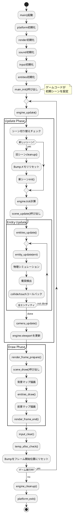

### レベル読み込み

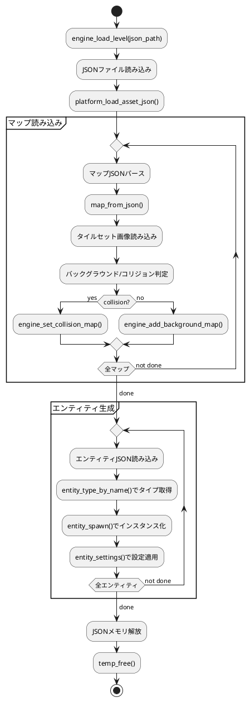

## モジュール間依存関係詳細

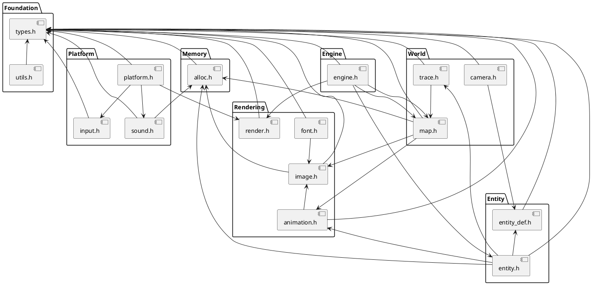

## 設計パターンと特徴

### 1. エンティティ・コンポーネント・システム (ECS)

high_impactは軽量なECSパターンを採用していますが、厳密なECSではなく、vtableベースのポリモーフィズムを使用しています。

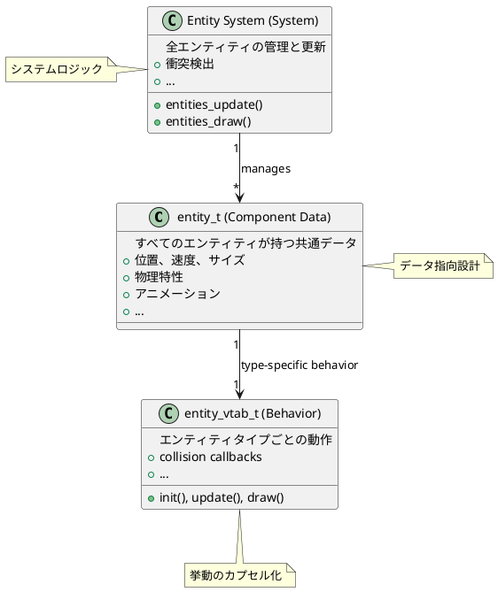

### 2. リソース管理パターン

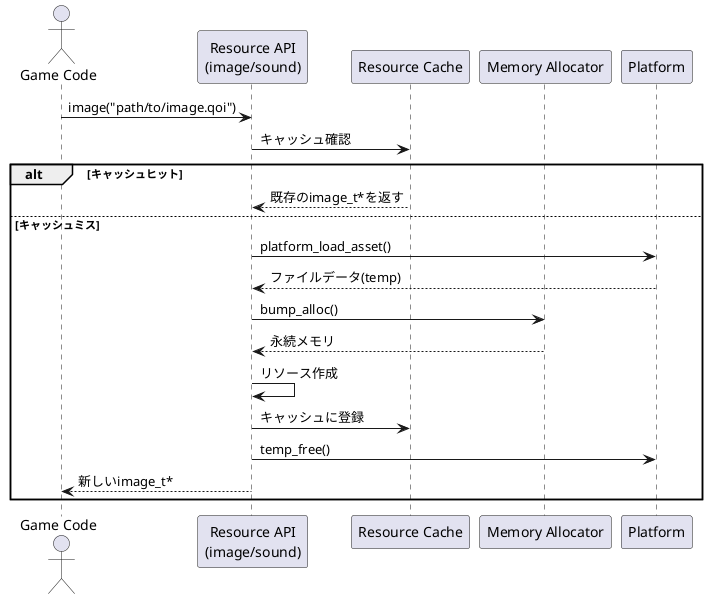

### 3. シーン管理とメモリライフタイム

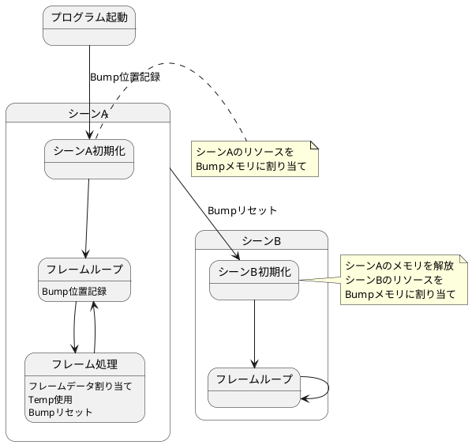

### 4. プラットフォーム抽象化

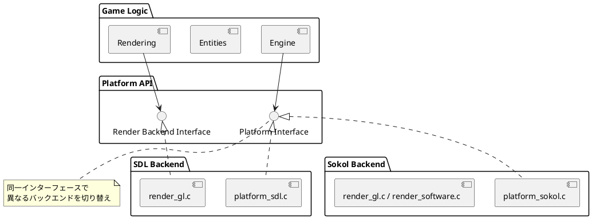

## ビルドとコンパイル

high_impactはライブラリではなくフレームワークとして機能します。ゲームコードと一緒にコンパイルする必要があります。

### ビルドターゲット

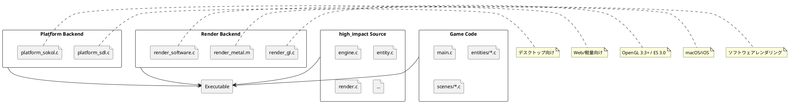

**Makefileターゲット:**
- `make sokol` - Sokolバックエンドでコンパイル
- `make sdl` - SDLバックエンドでコンパイル
- `make wasm` - WebAssembly向けコンパイル

## まとめ

high_impactの主な特徴:

1. **軽量設計** - 最小限の依存関係、シンプルなAPI
2. **カスタムメモリ管理** - malloc/free不使用、予測可能なメモリ使用
3. **クロスプラットフォーム** - SDL/Sokolによる複数プラットフォーム対応
4. **柔軟なレンダリング** - OpenGL/Metal/Software バックエンド
5. **シーンベース構造** - 明確なライフサイクル管理
6. **エンティティシステム** - vtableベースの拡張可能な設計
7. **統合されたツール** - Weltmeisterエディタによるレベル編集

この設計により、2Dゲーム開発に必要な機能を提供しながら、シンプルで理解しやすいコードベースを維持しています。
